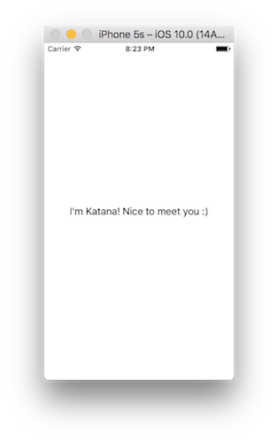

# Chapter 1 - Getting Started

In this chapter we discuss how to create a project that leverages Katana. We will use [CocoaPods](https://cocoapods.org/) as a dependency manager, but you can also use [Carthage](https://github.com/Carthage/Carthage) or just drop the Katana project into your application. See the the [Katana repository](https://github.com/BendingSpoons/katana-swift/) for more information.


### Create The Xcode Project

Let's start by creating a new Xcode project. Select the `Single View Application` template and use  `HelloWorld` as project name.

Since we are not going to use storyboard, delete `Main.storyboard`.  If you try to run the project now, it will crash because the system tries to load the storyboard file that we have just deleted. To fix this, select your project, go in the `General` tab and search for the `Main Interface` entry. Delete the value, which should be `main`, and try again. This time you should see a black screen. If it doesn't work, try to make a clean build first (shift+command+K) and then run again.

### Import Katana

Close Xcode and create a file named `Podfile` in the root of your project. Open the file and add this content:

```ruby
platform :ios, '8.3'
use_frameworks!

target 'HelloWorld' do
  pod 'Katana', '~> 0.1.0'
  pod 'KatanaElements', '~> 0.1.0'  
end
```

Open a terminal, go in the project's directory and type:

```shell
pod install
```

If you don't have `CocoaPods` installed, you can install it using `gem`:

```shell
gem install cocoapods
```

At the end of the process, you should see a file named `HelloWorld.xcworkspace`. From now on, we will use it instead of `HelloWorld.xcproject`.

### The Hello World

Create a new file named `App.swift` and copy this content

```swift
import Foundation
import Katana
import KatanaElements

struct App: NodeDescription {
  typealias PropsType = EmptyProps
  typealias StateType = EmptyState
  typealias NativeView = UIView
  
  var props: PropsType
  
  static func childrenDescriptions(props: PropsType,
                                   state: StateType,
                                   update: @escaping (StateType) -> (),
                                   dispatch: @escaping StoreDispatch) -> [AnyNodeDescription] {
    
    return [
      Label(props: Label.Props.build {
        $0.frame = props.frame
        $0.textAlignment = .center
        $0.text = NSAttributedString(string: "I'm Katana! Nice to meet you :)")
      })
    ]
  }
}
```

We are creating a new description with a Label. Don't worry about the details, we will explore them in the [next chapter](../Chapter2/README.md).

Open the `AppDelegate`, remove everything and paste this snippet:

```swift
import UIKit
import Katana

@UIApplicationMain
class AppDelegate: UIResponder, UIApplicationDelegate {
  
  var window: UIWindow?
  var renderer: Renderer?
  
  func application(_ application: UIApplication, didFinishLaunchingWithOptions launchOptions: [UIApplicationLaunchOptionsKey: Any]?) -> Bool {
    
    self.window = UIWindow(frame: UIScreen.main.bounds)
    self.window?.rootViewController = UIViewController()
    self.window?.makeKeyAndVisible()
    
    let view = self.window!.rootViewController!.view!
    
    var props = EmptyProps()
    props.frame = UIScreen.main.bounds 
    let app = App(props: props)
    
    self.renderer = Renderer(rootDescription: app, store: nil)
    self.renderer?.render(in: view)
    
    return true
  }
}
```

Here we are basically asking Katana to render with the description we just created. Once again, don't worry about the details: we will explore them in the [next chapter](../Chapter2/README.md).

Save, build and run. You should now see a white screen with a black text at the center of the screen!




### What's Next

We now have a working Hello World, but the best is yet to come!
Move to the [second chapter](../Chapter2/README.md) to learn how to create complex UIs with Katana.

