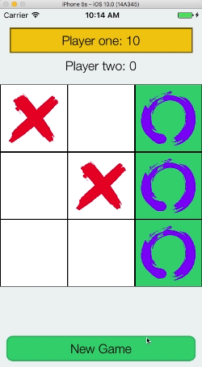

# Chapter 2 - UI

In this chapter we will explore how we can leverage Katana to create the UI of our TicTacToe Game. We will create a static version of the UI, meaning that we won't add any logic to our application but we will focus entirely to the user interface.

### Explore the project

We created a starting project for this chapter. You can find it in the `Source/Initial` folder. It contains a very basic skeleton for Katana applications, which just shows a red page, but it is enough as a starting point.

**App Delegate**

In the app delegate, we can find a basic boilerplate that is used to render the UI of the application. Let's take a look at the code

```swift
// 1
self.window = UIWindow(frame: UIScreen.main.bounds)
self.window?.rootViewController = UIViewController()
self.window?.makeKeyAndVisible()

let view = self.window!.rootViewController!.view!

// 2
let intro = GameBoard(props: GameBoard.Props.build {
	$0.frame = UIScreen.main.bounds
})

// 3
self.renderer = Renderer(rootDescription: intro, store: nil)
self.renderer?.render(in: view)
```

In **(1)** we create the window we will use to render the UI. We assign a simple instance of `UIViewController` as `rootViewController`. We don't use view controllers in Katana,  but `UIKit` requires them.

In **(2)** we create a `GameBoard` instance, which is the description where we will put our UI. The only property we need to set it the frame of this piece of UI. Since we want to have it fullscreen, we use `UIScreen.main.bounds`

In **(3)** we trigger the render operation. This is where Katana will use the description to compute the UI to render in the screen. `Renderer` is charge of this. We don't need any logic right now, so we can leave the store empty (in the next chapters we will use it though!).


**GameBoard**

The `GameBoard` description just contains a simple full screen red view. The only piece of code that we want to discuss is the following

```swift
struct GameBoard: NodeDescription {
  typealias PropsType = Props
  typealias StateType = EmptyState
  typealias NativeView = UIView
  typealias Keys = ChildrenKeys
  
  // other code
}
```

We basically add these lines in our descriptions to define common names for our associated types (type of the properties, the state and so on). We use this convention in our examples and this tutorial, but it is just a convention, feel free to just use the types directly in the method signatures.

**UIColor+GameBoard and KatanaElements+GameBoard**

Those two categories are used to encapsulate the style of our UI. Since this tutorial is focused on understanding the Katana principles and usage, we provide the UI style in these categories without discussing them. It is just plain UIKit really

### Start With The Interface: The Properties

When it comes to create a new description, we usually start from the definition of it's interface. Let's take a look at the result we want to achive:




What we need is:

* The score of the two players
* The player that should do the next move (which has a yellow label)
* The moves that have already been made
* Something that tells us if the game is finished (we need to show the `New Game` button)
* Something that tells us if there is a winning line (that is, the cells that compose a winning combination)

Starting from these requirements we define the GameBoard's properties:

```swift
extension GameBoard {
  struct Props: NodeDescriptionProps, Buildable {
    var frame: CGRect = .zero
    var key: String?
    var alpha: CGFloat = 1.0
    
    var isGameFinished: Bool
    var turn: Player
    var board: [Player?]
    var winningLine: [Int]?
    
    var player1Score: Int
    var player2Score: Int
    
    var isLoading: Bool
    
    init() {
      self.isGameFinished = true
      self.turn = .one
      self.player1Score = 0
      self.player2Score = 0
      self.winningLine = nil
      self.isLoading = false
      
      self.board = [
       nil, nil, nil,
       nil, nil, nil,
       nil, nil, nil,
      ]
    }
  }
}
```

Besides the basic variables (frame, key and alpha) we define everything we need to manage the information we listed above. The `init` is used as default starting point and is required by the `Buildable` protcol. It will be also very useful in the future to check our UI without writing the logic of the application. For now, just copy this code in your project and let's move to the next step: add the first piece of UI to our application!

### Players Score: Our First Piece of UI

Let's start by adding the two labels, that are used to show the player scores and the current turn, and the background.

Let's delete the red view from `childrenDescriptions` and add this instead:

```swift
var children: [AnyNodeDescription] = [
  // 1
  View(props: View.Props.build {
    $0.backgroundColor = .flatLightGrey()
    $0.setKey(Keys.background)
  }),

  // 2
  Label(props: .gameBoardLabelProps(content: "Player one: \(props.player1Score)", key: Keys.player1Score, shouldPlay: props.turn == .one)),

  Label(props: .gameBoardLabelProps(content: "Player two: \(props.player2Score)", key: Keys.player2Score, shouldPlay: props.turn == .two)),
}

// 3
return children
```

In **(1)** we add the view we will use as background. The properties of the View are created leveraging the `Buildable` protocol. In the closure we define the key of the view (we will use it later to lay out the view) and the background color. We don't really need everything else.

In **(2)** we leverage the `gameBoardLabelProps` method to create the properties for the two labels.

In **(3)** we just return the children of our description and let Katana do the job for us.


If you try to compile the application now, you will receive some compilation errors due to the fact that we didn't defined the keys yet. Let's do it now: update the `ChildrenKey` enum in this way:

```swift
extension GameBoard {
  enum ChildrenKeys {
    case background
    case player1Score, player2Score
  }
}
```

Build and run! You should see an empty screen. This is not really what we want, but why we don't see anything? Well, we didn't define the layout of these elements. Katana just renders them with the default frame (which has a zero size). 


How can we define the layout logic of the description? Katana is not strongly tied to a specific layout system, but if offers the [Plastic](https://github.com/BendingSpoons/plastic-lib-iOS) layout system out of the box. Plastic is a library we leverage in Bending Spoons to create our applications. It is based on two pillars:

* Elements are lay out by defining relations between elements of the UI. The order in which relations are defined **is important**. For instance if you define that the height of the element A is the same of the one of the element B, but you haven't defined yet the height of the element B, then also the element A will never have an height, even if you define the height of A later. There isn't a constraint solver system like in Auto Layout
* The layout logic is defined starting from a `reference size`. The idea is the following: you have the preview of the final UI in a specific device (let's say the an iPhone 5). All the values you will add to the layout logic are measured in this device. Plastic will gracefully scale all the values by comparing the reference size in the iPhone5 to the size that there are in the running application

For more information about Plastic, you can refer to the [Objc implementation wiki](https://github.com/BendingSpoons/plastic-lib-iOS/wiki). In particular the [reference view explaination](https://github.com/BendingSpoons/plastic-lib-iOS/wiki/2.1.-Reference-View) and the [elements relationships explaination](https://github.com/BendingSpoons/plastic-lib-iOS/wiki/2.3.-Anchors-and-Constraints). The implementation details of the wiki are related to the Objc implementation, which is not what Katana uses. Katana, in fact, uses a Swift version of Plastic. That said,  theoretical concepts are the same so you can use the wiki as a source of information for Plastic.


Let's start by defining the `reference size` of `GameBoard`. The first step is to adopt the ``PlasticReferenceSizeable` protocol in the `GameBoard` struct. We then need to have a `referenceSize` variable.  Since we use an iPhone 5 as reference, and we decided that it should be fullscreen, the value will be the following

```swift
static var referenceSize = CGSize(width: 320, height: 568)
```

Once again, the reference size is the size of the piece of UI in the reference device. Since we use an iPhone5 and the GameBoard is full screen, we simply use the screen size of the iPhone 5. Note that this step is no necessary in the descriptions that are in the hierarchy under GameBoard. They will just use the relationship defined in GameBoard.


We are now ready to implement the logic of our layout.  Let' start by adding the `PlasticNodeDescription` protocol to `GameBoard`. It requires to define a new method: `layout(views: ViewsContainer<Keys>, props: PropsType, state: StateType)`. This is exaclty the method we can use to define our layout. Let's implement it:

```swift
static func layout(views: ViewsContainer<Keys>, props: PropsType, state: StateType) {
  // 1
  let nativeView = views.nativeView
  let player1Score = views[.player1Score]!
  let player2Score = views[.player2Score]!
  
  // 2
  player1Score.fillHorizontally(nativeView, insets: .scalable(0, 15, 0, 15))
  player1Score.setTop(nativeView.top, offset: .scalable(30))
  player1Score.height = .scalable(40)

  // 3
  player2Score.fillHorizontally(nativeView, insets: .scalable(0, 15, 0, 15))
  player2Score.top = player1Score.bottom
  player2Score.height = .scalable(40)
}
```

In **(1)** we get the references to some placeholders of the final views we can use to manipulate the layout. The `nativeView` is always available, so it is not an optional. The system can't be sure whether you have returned the two labels in the `childrenDescriptions` method, so the result of the subscript is optional. We know that we will always return them, so it is safe to use the bang operator.

In **(2)** we define the layout of the player 1 score label. In the first row we horizontally fill the space of the native view by leaving a space of 15 ponts with respect to the left and right edge. It is important to note that those points are scalable, which means they will be scaled using the reference size / current size relationship. In the second row we define that the top of the label is equal to the top of the native view with an offset of 30 scalable poinst. In the last row we define the height of the label

In **(3)** we define the layout of the second label, which is very similar to the first one.


Build and run, you should see the two labels in the screen!


### New Game Button

Let's move to the next piece: the button we will use to start a new game when the previous one is finished.

As before, let's add the description first in the `childrenDescriptions` method:

```swift
var children = [...]

if props.isGameFinished {
  let startButton = Button(props: .startButtonProps(
    title: "New Game",
    key: Keys.startButton,
    didTap: nil
  ))

  children.append(startButton)
}

return children
```

We are leveraging our `props` to conditionally return the button. Katana will take care of update/create or destroy the related UIKit element instance based on what you return in the method. 


The second part is add the layout. Add these lines to the `layout` method

```swift
let startButton = views[.startButton]
startButton?.asFooter(nativeView, insets: .scalable(0, 10, 10, 10))
startButton?.height = .scalable(40)
```

As you can see `Plastic` has several helper methods to quickly define your layout and make the code more readable. `asFooter` is just an example, but you can find all of them here and here (TODO add documentation link).

### The Game Board

Let's add now the central part of the UI: the matrix we can use to play the game. It is basically a 3x3 matrix of cells that can be tapped to make the player's move and they should also show an image if in the current game someone has tapped it.


Let's start by creating a new description: `GameCell`. As the name suggests, it will describe a single cell of the matrix. Here is the code

```swift
import Foundation
import Katana
import KatanaElements

struct GameCell: NodeDescription, PlasticNodeDescription {
  typealias PropsType = Props
  typealias StateType = EmptyState
  typealias NativeView = UIView
  typealias Keys = ChildrenKeys
  
  var props: PropsType
  
  // 2  
  static func childrenDescriptions(props: PropsType,
                                   state: StateType,
                                   update: @escaping (StateType) -> (),
                                   dispatch: @escaping StoreDispatch) -> [AnyNodeDescription] {
    
    var children: [AnyNodeDescription] = [
      Button(props: .gameCellButtonProps(
        isWinningCell: props.isWinningCell,
        didTap: nil
        key: Keys.button)
      )
    ]
    
    if props.player != nil {
      let image = Image(props: .gameCellImage(player: props.player, key: Keys.image))
      children.append(image)
    }
    
    return children
  }
  
  // 3  
  static func layout(views: ViewsContainer<Keys>,
                     props: PropsType,
                     state: StateType) {
    
    let nativeView = views.nativeView
    views[.image]?.fill(nativeView, insets: .scalable(10, 10, 10, 10))
    views[.button]?.fill(nativeView)
  }
}

extension GameCell {
  enum ChildrenKeys {
    case button, image
  }
}

extension GameCell {
  // 1
  struct Props: NodeDescriptionProps {
    var frame: CGRect = .zero
    var key: String?
    var alpha: CGFloat = 1.0
    
    var player: Player?
    var isWinningCell: Bool
    
    init(key: Any, player: Player?, isWinningCell: Bool) {
      self.player = player
      self.isWinningCell = isWinningCell      
      self.setKey(key)
    }
  }
}
```


As usual, let's start with the properties of the description, which are in **(1)**. Besides the basic properties (frame, key, alpha) we add a property (player) that we will use to understand if someone has picked the cell in the current game (this is why it is optional, it could be that the no one did it yet). We have also added `isWinningCell` which we will leverage to change the color of the cells that are part of a winning line (we will change the background to green, as shown in the initial screen).

In **(2)** we define the logic of the children. We always return a button and, if we have a player (that is, someone has choosen the cell before), also an image to show the proper symbol.

In **(3)** we define the layout, which is very simple. We just fill all the space with both the button and the image.

As you can see, we are not managing the button `didTap` property. This is because we will add the game logic in the next chapter. Just leave it `nil` for now.


The next step is integrate the nine (we have a 3x3 matrix) `GameCell` in the `GameBoard`. Update the `childrenDescriptions` by adding the following lines to the `children` array:

```swift
var children: [AnyNodeDescription] = [
  // background and labels here
  
  GameCell(props: GameCell.Props(key: Keys.cell1, player: props.board[0], isWinningCell: winningLine.contains(0))),
  
  GameCell(props: GameCell.Props(key: Keys.cell2, player: props.board[1], isWinningCell: winningLine.contains(1))),
  
  GameCell(props: GameCell.Props(key: Keys.cell3, player: props.board[2], isWinningCell: winningLine.contains(2))),
  
  GameCell(props: GameCell.Props(key: Keys.cell4, player: props.board[3], isWinningCell: winningLine.contains(3))),
  
  GameCell(props: GameCell.Props(key: Keys.cell5, player: props.board[4], isWinningCell: winningLine.contains(4))),
  
  GameCell(props: GameCell.Props(key: Keys.cell6, player: props.board[5], isWinningCell: winningLine.contains(5))),
  
  GameCell(props: GameCell.Props(key: Keys.cell7, player: props.board[6], isWinningCell: winningLine.contains(6))),
  
  GameCell(props: GameCell.Props(key: Keys.cell8, player: props.board[7], isWinningCell: winningLine.contains(7))),
  
  GameCell(props: GameCell.Props(key: Keys.cell9, player: props.board[8], isWinningCell: winningLine.contains(8))),
]
```

We can of course find ways to simplify the code (e.g., we can use a `for` stantement), but for sake of simplicity we will just add all the nine cells explicitly. 

The layout is slighly more complicated than the ones we saw so far. Right after the labels layout, add the following lines:

```swift
// cell container, first row
let firstRow = [views[.cell1]!, views[.cell2]!, views[.cell3]!]

firstRow.fill(left: nativeView.left, right: nativeView.right)
for cell in firstRow {
  cell.height = cell.width
  cell.setTop(player2Score.bottom, offset: .scalable(10))
}

// cell container, second row
let secondRow = [views[.cell4]!, views[.cell5]!, views[.cell6]!]

secondRow.fill(left: nativeView.left, right: nativeView.right)
for cell in secondRow {
  cell.height = cell.width
  cell.top = firstRow[0].bottom
}

// cell container, third row
let thirdRow = [views[.cell7]!, views[.cell8]!, views[.cell9]!]

thirdRow.fill(left: nativeView.left, right: nativeView.right)
for cell in thirdRow {
  cell.height = cell.width
  cell.top = secondRow[0].bottom
}
```

The idea is to layout the cells by row. For each row we fill the space between the left and right edges of the native view. We then define the height of the cell and the Y position (using the `top` relation).


Compile and run, you should see the UI of the initial screen. Hurray!

### Leverage Properties To Test The UI

Before wrapping up, let's discuss one important advantage we have in Katana. As you can see, we created the UI of the game without writing a single line of code of business logic. We defined the interface of the two involved descriptions and then, based on them, we created the UI. 

This is very useful for separation of concerns: we can work on the UI without thinking about the logic but just by defining an interface. This is actually very useful also to check that the UI behaves in the way we want. Besides automated tests, we can change the prop's `init` method and mock the different states we want to check. For instance, try to change the init method in this way:

```swift
init() {
  // mock
  self.isGameFinished = false
  self.turn = .one
  self.player1Score = 0
  self.player2Score = 0
  self.winningLine = nil

  self.board = [
   nil, nil, .two,
   nil, .two, nil,
   nil, .one, nil,
  ]
}
```

You should see the game board that shows a possible scenario of the game, where the player 1 should move, and there are already some cells picked.


This of course not intented for extensive and automated tests, there are better ways to do it (e.g., invoke directly the `childrenDescriptions` method with specific props and check the result) but it can be very very handy for quick checks of the UI implementation.

### Wrap It Up: What We have Learnt 

In this chapter we have learnt how to create the UI of an application using Katana. In particular:

* How to approach the UI: starts from the properties
* How to create the children of a description
* Create the layout using Plastic
* Handy methods to test the UI manually


You can find the final result in the `Source/final` folder.


In the [next chapter](../Chapter3/README.md), we will work on the logic of our wonderful game!

