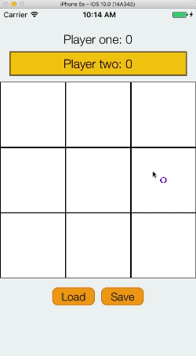

# TicTacToe 

This is a tutorial that will guide you step by step through the creation of a very simple Tic Tac Toe game using the [Katana framework](https://github.com/BendingSpoons/katana-swift/). This tutorial requires a very basic understanding of the Katana terminology. You can acquire it just by reading the Katana README!

Before starting, let's take a look at what we will build

The tutorial is divided into different chapters. Each chapter will be focused on a very specific topic and the idea is that, by following all the chapters, the result will be the Tic Tac Toe game. It is also possible to focus your attention to only some of the chapters, since each chapter provides a starting point for what will be discussed.

### Chapters

* [Chapter 1 - Getting Started](./Chapter1/README.md): Let's start from the basics:  how to create a very simple "Hello World" application from scratch using CocoaPods
* [Chapter 2 - UI](./Chapter2/README.md): This chapter explains how we can leverage Katana to create the game's UI
* [Chapter 3 - Game Logic](/chapter3/README.md): Let's add some logic to the game using the powerful Katana action system (**Not Added Yet**)
* [Chapter 4 - Animations](/chapter4/README.md): Every good game has some fancy animations, let's see how we can add them to our game! (**Not Added Yet**)
* [Chapter 5 - Save And Load A Match](/chapter4/README.md): What happens when in a Katana application you need to deal with external services? Let's discuss it by adding a new feature to our game: save and load a match! (**Not Added Yet**)

### TODO

Those are some chapters we want to add in the future:

* Refactor the UI. How can we split the various instances of `NodeDescription`? What are the best pratices when it comes to connect descriptions to the store?
* How can we leverage protocols to avoid type casting in actions?
* ​